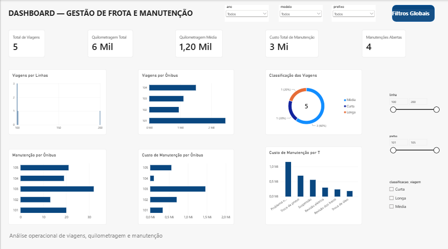

# 🚍 Pipeline ETL — Gestão de Frota e Manutenção

Pipeline de **ETL desenvolvido em Python e Pandas** para tratamento, integração, validação e análise de dados operacionais de uma empresa de transporte coletivo.

O projeto simula um cenário de **gestão de frota**, utilizando dados de ônibus, motoristas, linhas, viagens e manutenções para transformar dados brutos em informações estruturadas e indicadores para análise operacional e **Business Intelligence**.

---

## 📊 Dashboard

O projeto possui um dashboard desenvolvido no **Power BI**, permitindo analisar indicadores de viagens, quilometragem e manutenção da frota.



### Principais indicadores

- Total de viagens;
- Quilometragem total;
- Quilometragem média;
- Custo total de manutenção;
- Manutenções abertas;
- Viagens por linha;
- Viagens por ônibus;
- Custo de manutenção por ônibus;
- Custo de manutenção por tipo;
- Classificação das viagens;
- Quantidade de manutenções por ônibus.

O dashboard também possui **segmentações interativas** por linha, ônibus e classificação da viagem.

---

## 🎯 Objetivo

Desenvolver um pipeline capaz de:

- Carregar dados operacionais a partir de arquivos CSV;
- Remover registros duplicados;
- Realizar tratamento e padronização dos dados;
- Converter informações de data;
- Integrar diferentes fontes de dados utilizando relacionamentos entre tabelas;
- Criar indicadores operacionais e de manutenção;
- Classificar viagens de acordo com a distância percorrida;
- Validar a qualidade dos dados;
- Exportar datasets tratados;
- Disponibilizar os dados para análises em SQL e Power BI.

---

## 🔄 Fluxo do Pipeline

```text
Arquivos CSV
     ↓
📥 Ingestão
     ↓
🧹 Limpeza e tratamento
     ↓
🔗 Integração dos dados
     ↓
📊 Criação de indicadores
     ↓
✅ Validação
     ↓
📤 Exportação
     ↓
Dados tratados
     ↓
📈 Power BI / SQL